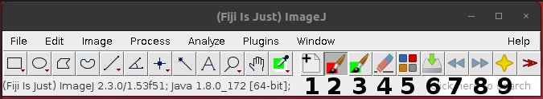
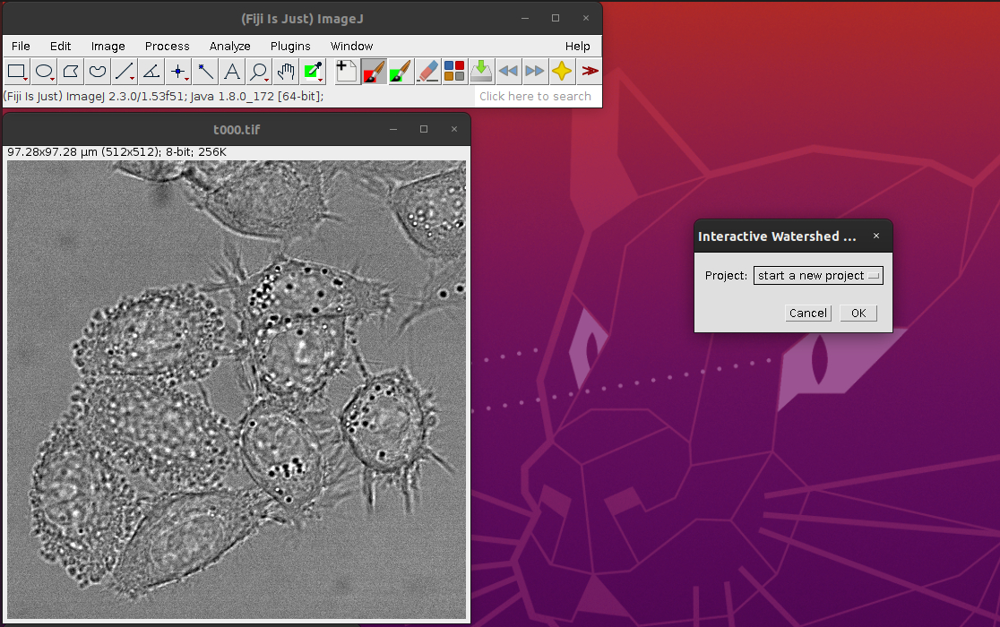
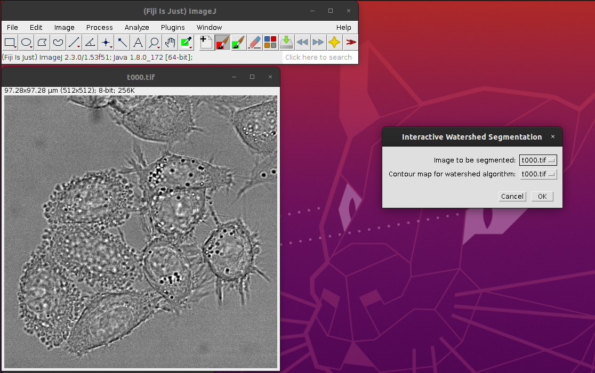
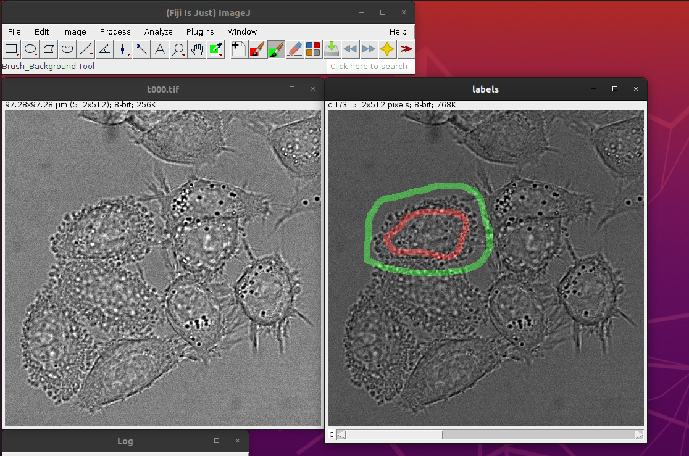
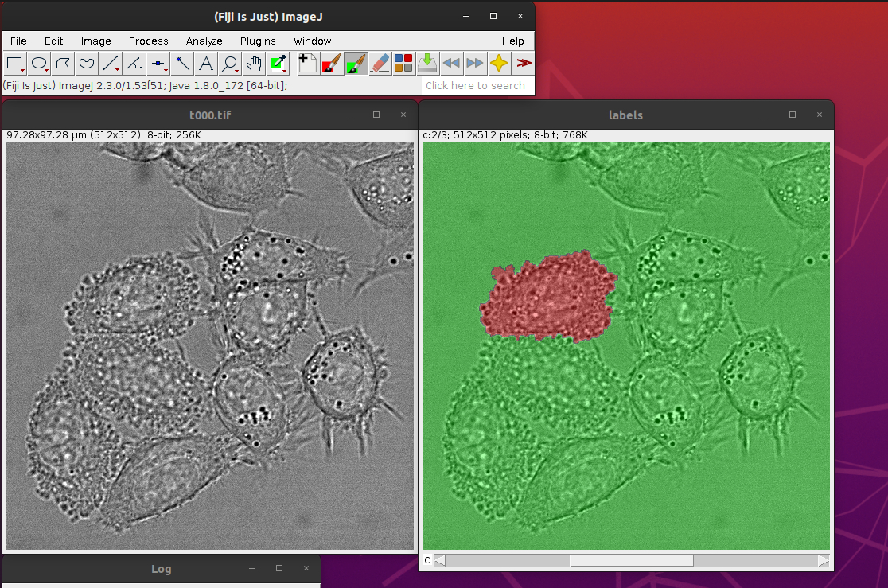
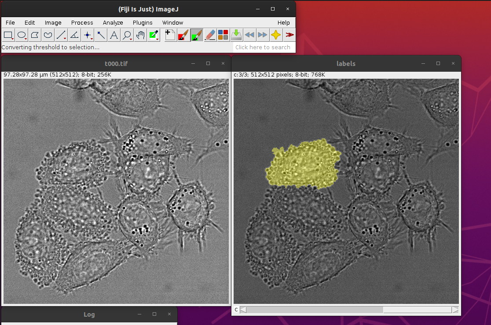
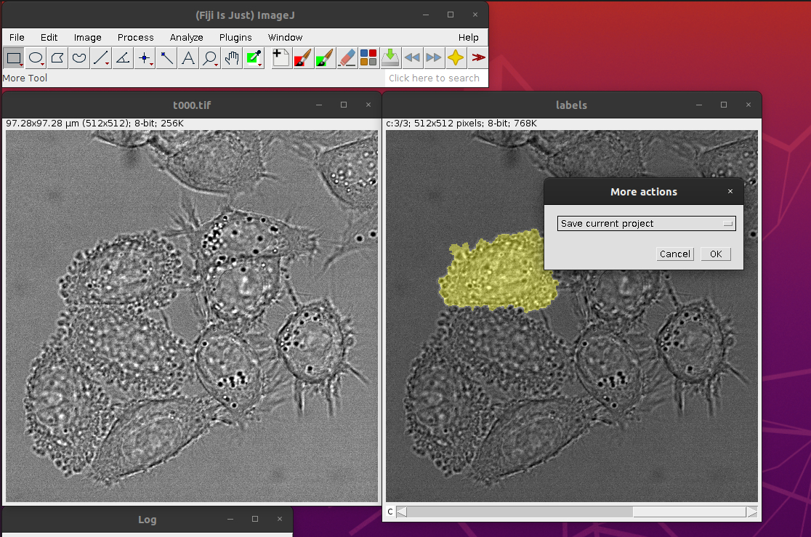

# iWatershedSeg

This repository cantains a Fiji/ImageJ macro toolset, that provides an 
interactive marker controlled watershed segmentation. This toolset uses icons 
comming from GIMP software, therefore icons are provided with the GIMP license 
(see \icons\iWatershedSeg\LICENSE).

## Install
1. install `MorphoLibJ` in Fiji/Imagej
2. copy `iWatershedSeg.ijm` and `icons` folder in `Fiji.app/macros/toolset` 
directory
3. copy the content of `luts` into `Fiji.app/luts` directory

## Usage

### Toolbar description

1. start/load a segmentation project
2. brush tool to mark the inside of an object to be segmented
3. brush tool to mark the outside of an object to be segmented
4. eraser: reset a mark to background
5. launch the marker controlled watershed algorithm
6. record the result of watershed
7. move to one frame backward if your input data is a time serie
8. move to one frame forward if your input data is a time serie
9. extra tools like saving a project

### Start a project
Click on the tool `1` and choose `start a new project`. If your data is a volume
or a time series, you must verify that your data have the appropriate dimension 
in Z (.e. `slices`) or time (i.e. `nFrames`). The easiest way to do that, is to
use `Image > Hypertstack > Hyperstack to stack` tool. And if needed use 
`Image > Hypertstack > Re-order Hyperstack ...`.

Select a contour map, typically the magnitude of the gradient 
(see `Plugins > FeatureJ > FeatureJ Derivatives`). In this example, the image is 
obtained from phase-contrast microscopy, which directly render the cells borders.
Threrefore, we use the input image as contour map.

### Creation of markers
With the red brush tool mark the inside of your object, with the green brush 
tool mark the outside.

### Run the watershed algorithm

### Record the labelling
If you are happy with the result, you can register your object, otherwise you can 
adjust markers with the brushes and the eraser, and re-run the watershed 
algorithm.

### Save the current segmentation process
In the extral tools menu choose `Save current project`.

